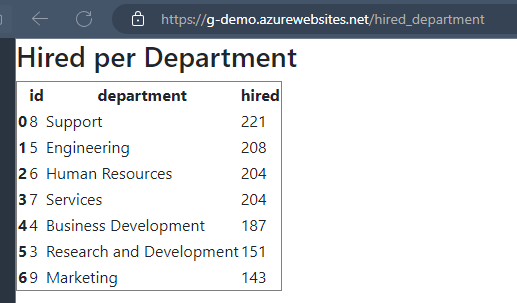

# Welcome to G-Challenge _by Luis Benitez_
This is an API demo deployed as solution of “Data Engineering Coding Challenge”

There are avalible three endpoints to upload .csv files and twice more to get information about hired employees


## QuickStart
All services and architecture of solution runs on Azure Cloud.

**The service is only avalible on:** [g-demo.azurewebsites.net](g-demo.azurewebsites.net) during limited time. (16-07-2023)

If you need extend the time to make test, please contact with the administrator

_Please check the endopints and methods avalible to do your own requests in the next sections._

## Uploading data
You can upload new data **(only uploads as replace are available)** over the three different tables: departments, jobs and hired_employees

**Structure of table ‘departments’**
| column     | type    | description                                 |
|------------|---------|---------------------------------------------|
| id         | INTEGER | Id of the department                        |
| department | STRING  | Name of the department (255 characters max) |
|            |         |                     |


**Structure of table jobs**
| column | type    | description                          |
|--------|---------|--------------------------------------|
| id     | INTEGER | Id of the job                        |
| job    | STRING  | Name of the job (255 characters max) |
|        |         |                                      |


**Structure of table hired_employees**
| column        | type     | description                                           |
|---------------|----------|-------------------------------------------------------|
| id            | INTEGER  | Id of the employee                                    |
| datetime      | DATETIME | Hire datetime in format Y-m-d[T]:H:M:S[Z]             |
| department_id | INTEGER  | Id of the department which the employee was hired for |
| job_id        | INTEGER  | If of the job wich the employee was hired for         |

**Only .csv files are supported, be sure of upload csv separated  by comma and compatible with the schemas listed before.**

### Load departments [POST]
**Endpint**: https://g-demo.azurewebsites.net/load_departments

**Example of request in Python**
```python
import requests

url = "https://g-demo.azurewebsites.net/load_departments"

payload = {'chunk': '1000'} #Optional (INSERT chunk-size)
files=[
  ('file',('departments.csv',open('yourdata/departments.csv','rb'),'text/csv'))
]
headers = {}

response = requests.request("POST", url, headers=headers, data=payload, files=files)

print(response.text)
```

**Succesfull request**
```json
{
    "error": false,
    "file-uploaded": "departments",
    "msg": null,
    "status": true,
    "uploaded": true
}

```

**Failed request**
```json
{
    "error": true,
    "msg": "error <type> [description]",
    "status": false
}
```

### Load jobs [POST]
**Endpint**: https://g-demo.azurewebsites.net/load_jobs

**Example of request in Python**
```python
import requests

url = "https://g-demo.azurewebsites.net/load_jobs"

payload = {'chunk': '1000'} #Optional (INSERT chunk-size)
files=[
  ('file',('jobs.csv',open('yourdata/jobs.csv','rb'),'text/csv'))
]
headers = {}

response = requests.request("POST", url, headers=headers, data=payload, files=files)

print(response.text)
```

**Succesfull request**
```json
{
    "error": false,
    "file-uploaded": "jobs",
    "msg": null,
    "status": true,
    "uploaded": true
}

```

**Failed request**
```json
{
    "error": true,
    "msg": "error <type> [description]",
    "status": false
}
```

### Load hired_employees [POST]
**Endpint**: https://g-demo.azurewebsites.net/load_employees

**Example of request in Python**
```python
import requests

url = "https://g-demo.azurewebsites.net/load_employees"

payload = {'chunk': '1000'} #Optional (INSERT chunk-size)
files=[
  ('file',('hired_employees.csv',open('yourdata/hired_employees.csv','rb'),'text/csv'))
]
headers = {}

response = requests.request("POST", url, headers=headers, data=payload, files=files)

print(response.text)
```

**Succesfull request**
```json
{
    "error": false,
    "file-uploaded": "hired_employees",
    "msg": null,
    "status": true,
    "uploaded": true
}

```

**Failed request**
```json
{
    "error": true,
    "msg": "error <type> [description]",
    "status": false
}
```

## Get metrics about the data
You can explore the data that was inserted in the previous section. There are avalible two endpoints each one execute a specific SQL server Querie.

### Get hired employees by department [POST]
> "List of ids, name and number of employees hired of each department that hired more
employees than the mean of employees hired in 2021 for all the departments, ordered
by the number of employees hired (descending)."

For this question, the following SQL query is executed:
```sql
    SELECT d.id AS id, d.department AS department, COUNT(*) AS hired
        FROM hired_employees h
        INNER JOIN departments d ON h.department_id = d.id
        WHERE YEAR(h.datetime) = 2021
        GROUP BY
            d.id,
            d.department
        HAVING
            COUNT(*) > (SELECT AVG(cnt) FROM (SELECT COUNT(*) AS cnt 
            FROM hired_employees WHERE YEAR(datetime) = 2021 GROUP BY department_id) AS subquery)
        ORDER BY
            hired DESC;
```

This query makes an inner join between the tables departments and hired_employees to get only departments present in both tables where year equal to 2021.

The data are group by id of department and name.

The HAVING clausule is use to filter the departments that hired more employees that the mean during 2021. 'subquery' is a temporal table that count the number of employees per department in 2021.

AVG is used to get the mean of employees hired in all departments and the condition 'COUNT(*) > (SELECT AVG(cnt) FROM ... )' compare the total employees hired by each department with the mean of employees in all departments. Only records greater than the mean is select

#### Explore the data [GET]
**Endpint**: https://g-demo.azurewebsites.net/hired_department

**The best way for consult the information is using a web explorer**, you only need to do click in the previous link



**Example of request in Python**

If you prefeer execute a request out of the web explorer, You can add _'Content-Type': 'application/json'_ to the headers and **the result returned will be a JSON file**
```python
import requests
import json

url = "https://g-demo.azurewebsites.net/hired_department"

payload = {}
headers = {
  'Content-Type': 'application/json',
  'charset': 'utf-8'
}

response = requests.request("GET", url, headers=headers, data=payload)

print(response.text)
```

**Succesfull request**
```json
{
    "data": [
        {
            "department": "Support",
            "hired": 221,
            "id": 8
        },
        {
            "department": "Engineering",
            "hired": 208,
            "id": 5
        }
        ...
     
    ],
    "error": false,
    "msg": null,
    "status": true
}
```

**Failed request**
```json
{
    "error": true,
    "msg": "error <type> [description]",
    "status": false
}
```


